<h1 align="center">🔳 RISC-V SoC Tapeout Program — Week 2️⃣</h1>

<p align="center">

</p>

---

<div align="center">

# 🚀 Week 2 — Functional Modeling & BabySoC Simulation

🌟 This is **Week 2** of the **VSD RISC-V SoC Tapeout Program** —  
I explored **SoC fundamentals**, studied the **BabySoC architecture**,  
understood the concept of **functional modeling**,  
and performed **simulations using Icarus Verilog and GTKWave** to observe BabySoC behavior.

</div>

---


<details>
<summary><h2> What is a System on a Chip (SoC)?</h2> </summary>


<p align="center">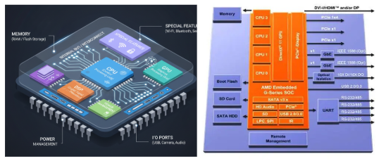</p>

A **System on a Chip (SoC)** is like fitting an entire computer onto a single microchip. Instead of using many separate components like CPU, memory, input/output controllers, graphics, and connectivity chips, an SoC packs most (or all) of them into one compact silicon chip. This makes devices smaller, faster, and more power efficient—perfect for smartphones, wearables, smart appliances, and even cars.

---

## **Main Components Inside an SoC (with explanations)**

## 1. CPU (Central Processing Unit)🧠

<p align="center">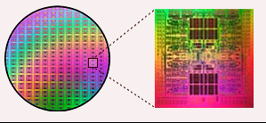</p>

The CPU is the **main decision-maker** inside an SoC. Think of it as the *manager* that handles all general tasks. Here's what it does:

- Executes instructions from the operating system and apps.
- Performs arithmetic, logic, and control operations.
- Manages scheduling, multitasking, and system coordination.
- Often comes as multi-core (e.g., quad-core, octa-core) to handle multiple tasks at once.

---

## 2. GPU (Graphics Processing Unit)

<p align="center">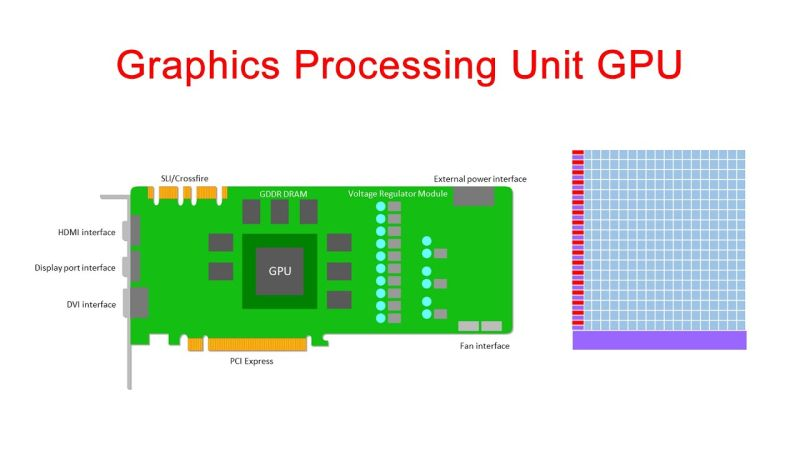</p>

The GPU is designed for **heavy visual and parallel processing tasks**. It’s like the *artist + accelerator* of the chip.

- Renders UI, videos, animations, and games.
- Handles 2D and 3D graphics efficiently.
- In newer SoCs, it's also used for AI, image processing, and machine learning computations.

---

## 3. Memory (RAM, Cache, and Storage Controllers)💾

<p align="center">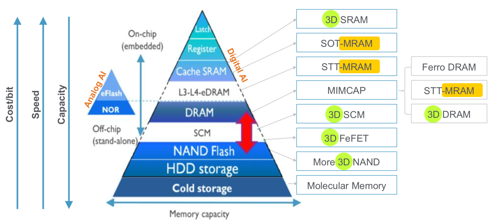</p>

Memory helps the CPU and GPU work quickly by storing data temporarily.

- **RAM** holds apps and active processes for quick access.
- **Cache** is small but ultra-fast memory near the CPU for frequently used data.
- **Storage interfaces** (like eMMC, UFS, or flash controllers) manage long-term data.

---

## 4. DSP (Digital Signal Processor)

<p align="center">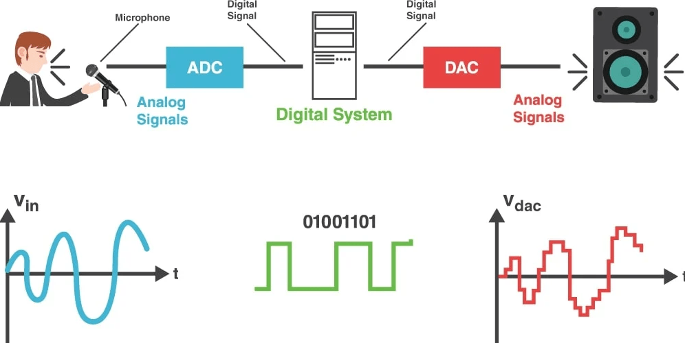</p>


A DSP is a **specialized mini-processor** optimized for handling continuous signals like audio, video, and sensors.

- Used in voice assistants, image enhancement, and audio processing.
- Performs real-time encoding, decoding, and filtering.
- Reduces CPU load by offloading media-related work.

---

## 5. Connectivity Units

<p align="center">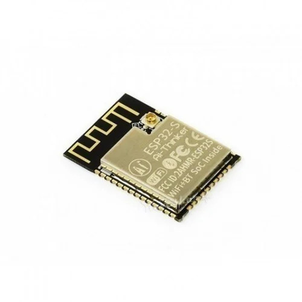</p>

These blocks make the device capable of communicating wirelessly or wired.

- Includes **Wi-Fi, Bluetooth, GPS, NFC, LTE, and 5G modules**.
- Uses dedicated modems and RF circuits.
- Enables location services, internet access, device pairing, etc.

---

## 6. I/O Interfaces🔌

<p align="center">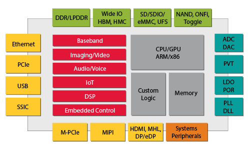</p>

<p align="center">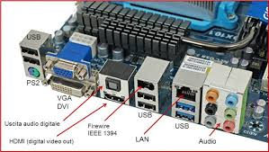</p>

These are the **communication bridges** between the SoC and external components.

Common interfaces include:

- **USB, HDMI, PCIe** – for display, storage, and external devices
- **UART, SPI, I²C** – for sensors, controllers, and debugging
- **GPIO pins** – for general-purpose connections

---

## 7. Power Management Unit (PMU)

The PMU ensures the SoC **uses power efficiently** without overheating or draining the battery.

- Regulates voltage and power delivery to different blocks.
- Handles sleep modes, wake-up events, and charging logic.
- Extends device battery life while balancing performance.

---

## 8. Security Blocks 🔐

<p align="center">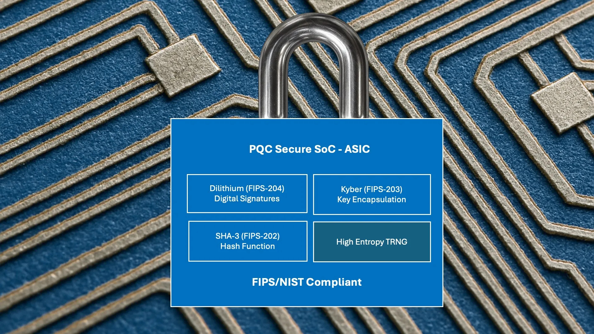</p>

Security modules protect the system from unauthorized access and attacks.

- Includes **Secure Boot**, **cryptographic engines**, and **Trusted Execution Environments (TEE)**.
- Handles encryption, biometric processing, and data protection.
- Prevents tampering, malware, and firmware modification.

---

## 9. AI / Neural Processing Units (NPUs or TPUs)

<p align="center">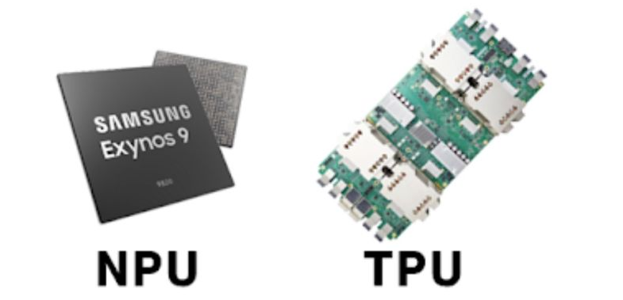</p>

Modern SoCs often integrate dedicated AI engines.

- Accelerates tasks like face recognition, object detection, and voice AI.
- Performs matrix multiplications faster than CPUs/GPUs.
- Saves power by offloading machine learning workloads.

---

## **Why SoCs Are So Impressive🌟**

<p align="center">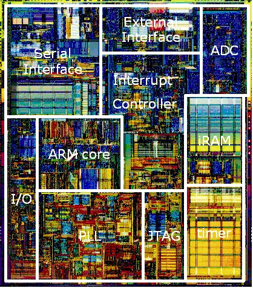</p>

Here’s why SoCs are game-changers:

- **Compact Size:** Multiple components on a single chip → smaller devices.
- **Low Power Consumption:** Ideal for mobile and battery-based gadgets.
- **High Performance:** Components communicate faster within one chip.
- **Cost Efficient:** Fewer components → cheaper manufacturing and assembly.
- **Less Heat & Better Integration:** Everything is designed to work together.

---

## **Devices and Places Where SoCs Are Used**

<p align="center">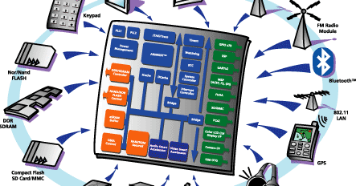</p>

SoCs are everywhere! Some common use cases:

- **Smartphones & Tablets**
- **Smartwatches & Fitness Bands**
- **Smart TVs and Streaming Devices**
- **IoT and Smart Home Gadgets**
- **Drones & Robotics**
- **Automotive Systems (ADAS, infotainment)**
- **Gaming Consoles & Handhelds**
- **Medical and Industrial Devices**

---

## **Well-Known SoC Examples📱**

<p align="center">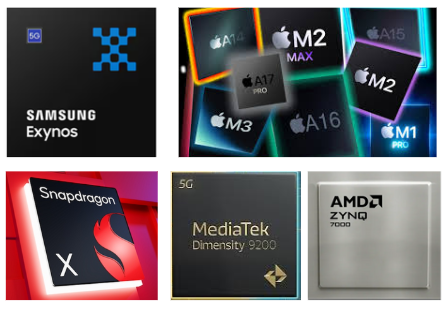</p>

Here are well-known examples:

- **Apple A-Series / M-Series** – iPhones, iPads, Macs
- **Qualcomm Snapdragon** – Android phones, AR/VR devices
- **MediaTek Dimensity / Helio** – Smartphones and smart TVs
- **Samsung Exynos** – Samsung mobile devices
- **NVIDIA Tegra / Orin** – Automotive, gaming, embedded AI
- **Broadcom BCM chips** – Raspberry Pi boards, routers
- **AMD/Xilinx Zynq SoCs** – FPGA + ARM for embedded systems

---

## **⚠️ Difficulties and Limitations of SoCs**

<p align="center">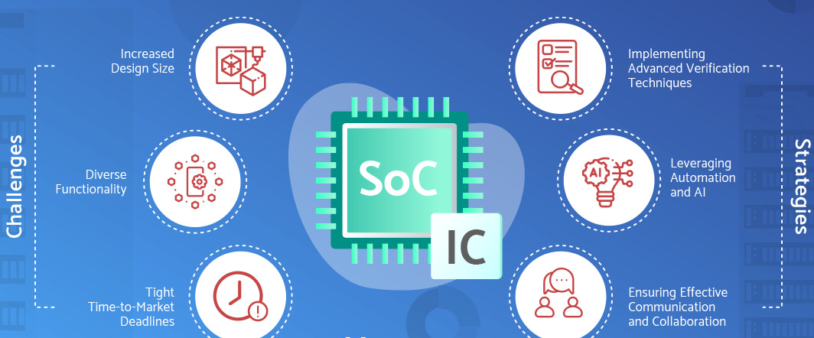</p>

Even though they’re powerful, SoCs come with some issues:

- **Design Complexity:** Integrating many subsystems on one chip is difficult.
- **High Development Cost:** Requires advanced tools and long design cycles.
- **Limited Upgradeability:** You can’t replace individual parts like CPU or GPU.
- **Thermal Management Issues:** High performance in compact space means more heat.
- **Customization Limits:** Harder to tailor compared to modular PCB-based systems.

---


</details>

<details>
<summary><h2>VSDBabySoC</h2></summary>


<p align="center"></p>

VSDBabySoC is a compact (small-scale) SoC intended primarily as a **testbed / learning platform**. The goals include:

- **Simultaneously test multiple open-source IP cores** (digital, analog, mixed) in one design environment.
- **Analog calibration** and validation, e.g. of PLLs, DACs, clocking circuits.
- **Bridging digital and analog domains** — not just a pure digital SoC.
- **Interfacing with external analog devices** like TVs, phones (through analog outputs) as proof-of-concept to show how digital → analog conversion can drive real-world interfaces.

From your description, the major blocks are:

1. **RVMYTH** — a small RISC-V microprocessor core, which drives digital logic and controls peripherals.
2. **PLL (8× PLL block)** — for clock generation and distribution.
3. **10-bit DAC** — converts digital output (from RVMYTH) to analog signal, which is exposed at an output pin (or net “OUT”).

These together make the SoC both digital and analog, with a mixed-signal flavor.

---

## Key Components

Here is a breakdown of important sub-blocks and their design challenges you might consider or expect in the code / hardware design:

## **1. RVMYTH (RISC-V CPU Core) 🧠**

<p align="center">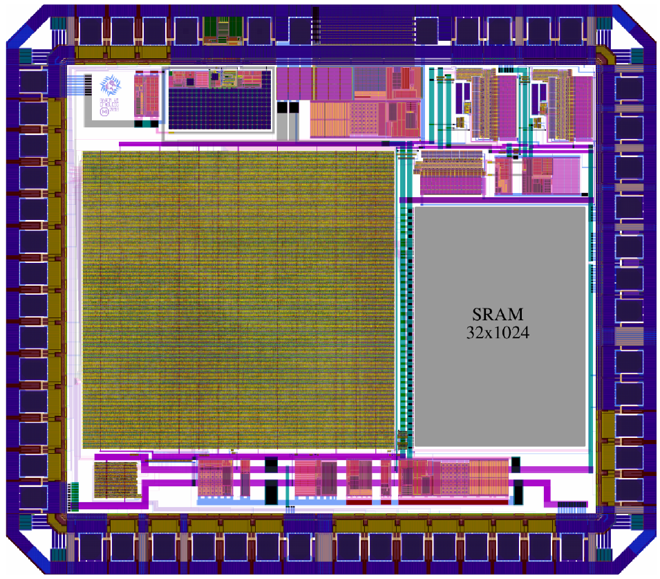</p>

### 🔎 What is it?

RVMYTH is a lightweight, open-source **RISC-V microprocessor core**. It implements the **RV32I instruction set**, providing the essential integer instructions for embedded and educational use. Being **modular and free**, RISC-V cores like RVMYTH are easy to integrate, customize, and study. Despite its simplicity, it reflects all real CPU stages (fetch, decode, execute, memory access, write-back), making it an excellent teaching and SoC-integration processor.

### ⚙️ Functionality

- Acts as the CPU of the SoC.
- Executes programs stored in memory or provided via instruction streams.
- Generates digital values (e.g., in register r17) to feed the DAC.
- Controls SoC components like DAC enable/disable and clock interaction.

### 🌟 Specialty

- Fully open-source, minimal, and educational.
- Simple enough to learn, yet realistic enough for practical use.

### 🧩 Types

- RV32I ISA-based.
- Pipelined or non-pipelined versions depending on integration.

### 🎯 Why in BabySoC?

- Serves as the “brain” of the SoC.
- Generates test data for DAC conversion.
- Demonstrates computation + mixed-signal output.

### ⚠️ Challenges

- Handling pipeline hazards.
- Efficient memory/I/O interfacing.
- Clock synchronization with PLL.
- Maintaining small area and low power.

---

## **2. Phase-Locked Loop (PLL)**

<p align="center">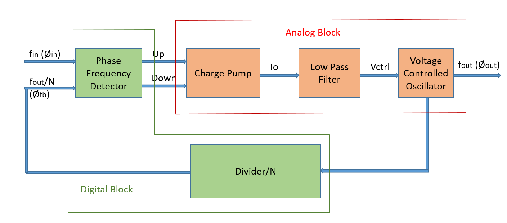</p>
### 🔎 What is it?

A **Phase-Locked Loop (PLL)** is a feedback-based circuit that generates an output clock synchronized in **frequency and phase** with a reference clock. BabySoC uses an **8× PLL** to multiply the reference clock for high-speed operation, ensuring system-wide synchronization.

### ⚙️ Functionality

- Produces a stable, high-frequency clock.
- Synchronizes all SoC parts.
- Multiplies reference clock ×8 in BabySoC.

### 🌟 Specialty

- Ensures synchronization of all blocks.
- Reduces jitter and timing mismatches.
- Enables multiple frequency domains.

### 🧩 Types

- Analog PLL.
- Digital PLL (DPLL).
- All-Digital PLL (ADPLL).

### 🎯 Why in BabySoC?

- Provides realistic clock generation.
- Ensures RVMYTH and DAC operate in sync.
- Overcomes limitations of external clocks.

### ⚠️ Challenges

- Designing stable VCO, loop filters, phase detectors.
- Managing jitter and noise coupling.
- Ensuring correct lock times and stability.

---

## **3. Digital-to-Analog Converter (DAC – 10-bit)**

<p align="center">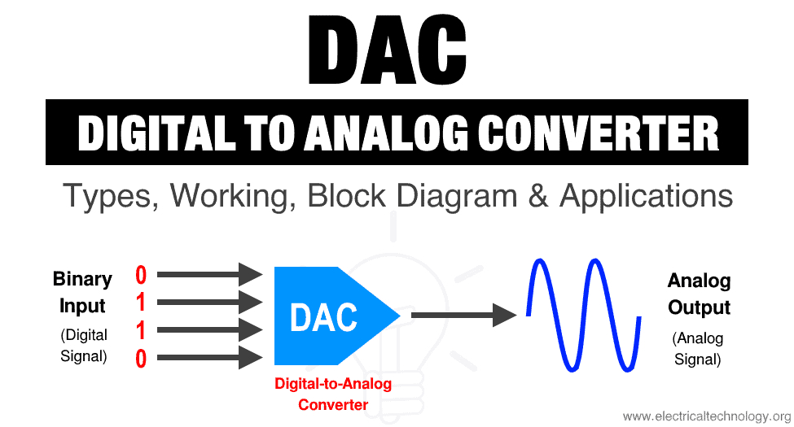</p>
### 🔎 What is it?

A **DAC (Digital-to-Analog Converter)** converts binary data into continuous analog signals (voltage or current). It is the **gateway from digital logic to the real world**. BabySoC’s 10-bit DAC supports **1024 discrete levels**, ideal for multimedia and analog testing.

### ⚙️ Functionality

- Converts RVMYTH’s 10-bit data to analog output.
- Produces waveforms for external use or lab testing.
- Enables mixed-signal demonstration.

### 🌟 Specialty

- Direct bridge between digital and analog domains.
- 10-bit resolution (1024 steps).
- Key for multimedia and sensor applications.

### 🧩 Types

- Weighted Resistor DAC.
- R-2R Ladder DAC.

<p align="center">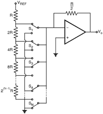</p>

- Sigma-Delta DAC.

<p align="center">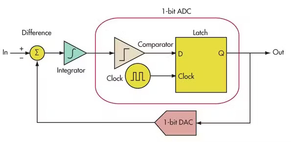</p>

### 🎯 Why in BabySoC?

- Demonstrates digital → analog conversion.
- Makes computation outputs observable as real signals.
- Useful for audio tones, waveform demos.

### ⚠️ Challenges

- Maintaining accuracy and linearity.
- Fast settling for high-speed operation.
- Precise resistor matching.
- Designing output buffers for loads.

---

## **4. Clock & Reset / Domain Management**

<p align="center">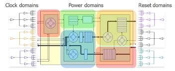</p>

### 🔎 What is it?

The **Clock & Reset subsystem** coordinates system startup, timing, and domain synchronization. It ensures safe initialization by holding blocks in reset until clocks are stable, and it saves power through clock gating.

### ⚙️ Functionality

- Provides reset signals during startup or recovery.
- Enables/disables PLLs and DACs.
- Manages multiple clock domains.

### 🌟 Specialty

- Backbone of SoC timing.
- Ensures safe and reliable operation.
- Essential for low-power design.

### 🧩 Types

- Single-domain (same clock for all).
- Multi-domain (different clocks per block).

### 🎯 Why in BabySoC?

- Ensures CPU and DAC start only after PLL locks.
- Manages synchronization across domains.
- Prevents undefined startup states.

### ⚠️ Challenges

- Designing reset sequencing.
- Avoiding metastability in crossings.
- Balancing power vs. performance.

---

## **5. Memory / Peripherals**

<p align="center">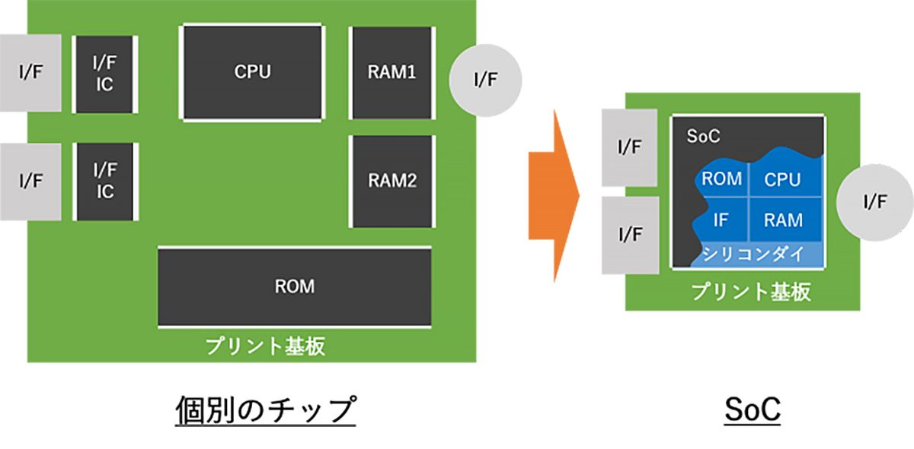</p>
### 🔎 What is it?

Memory and peripherals provide the **support system** for the CPU. Memory stores instructions/data, while peripherals (like buses or I/O) enable communication between CPU and SoC components.

### ⚙️ Functionality

- Stores data and instructions.
- Interfaces CPU with I/O devices (e.g., DAC).

### 🌟 Specialty

- Makes CPU communication efficient.
- Provides memory-mapped control of peripherals.

### 🧩 Types

- ROM/RAM.
- APB, AHB, AXI-lite buses.

### 🎯 Why in BabySoC?

- Optional, but enhances realism of the SoC.
- Supports expanded functionality.

### ⚠️ Challenges

- Correct address decoding.
- Timing closure across buses.
- Setup/hold requirements in memory cells.

---

## **6. Analog / Mixed-Signal Interface**

### 🔎 What is it?

The **AMS interface** isolates sensitive analog blocks (DAC, PLL) from digital switching noise generated by the CPU. It uses **guard rings, isolation wells, and biasing circuits** to ensure analog performance is not degraded.

### ⚙️ Functionality

- Protects analog circuits from digital noise.
- Maintains clean references and supplies.

### 🌟 Specialty

- Ensures reliable mixed-signal integration.
- Protects analog precision against crosstalk.

### 🧩 Types

- Guard rings & isolation.
- Bias/reference circuits.

### 🎯 Why in BabySoC?

- Prevents DAC errors due to CPU noise.
- Maintains PLL stability.

### ⚠️ Challenges

- Noise, crosstalk, and coupling control.
- Strict layout constraints.
- Stable reference/biasing.

---

## Design Flow & Physical Implementation

<p align="center">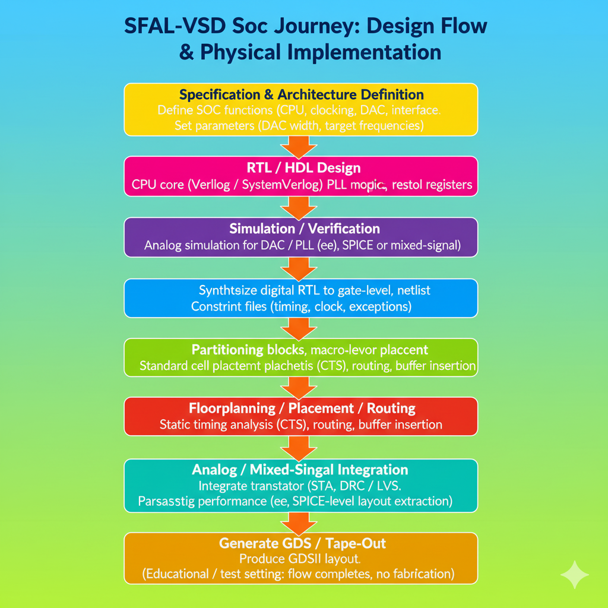</p>

</details>


--- 
# Project Structure

ASSETS

# project Cloning 

👉 Follow the commands below to setup project essentials 
```
git clone https://github.com/manili/VSDBabySoC.git
cd VSDBabySoC/

maddy@Madhavan-shree:~/Desktop/open_source_tapout/VLSI/VSDBabySoC$ls
images  LICENSE  Makefile  README.md  src

maddy@Madhavan-shree:~/Desktop/open_source_tapout/VLSI/VSDBabySoC$ cd src/module

maddy@Madhavan-shree:~/Desktop/open_source_tapout/VLSI/VSDBabySoC$ ls
avsddac.v   pseudo_rand_gen.sv  testbench.rvmyth.post-routing.v
avsdpll.v   pseudo_rand.sv      testbench.v
clk_gate.v  rvmyth.tlv          vsdbabysoc.v

```
# Cnverstion of TL-Verilog -> Verilog

❗ At the beginning, you’ll only find the rvmyth.tlv file inside the src/module/ directory, because the RVMYTH core is implemented in TL-Verilog. To run simulations, this needs to be transformed into a .v file. 
Follow the steps below to perform the TL-Verilog to Verilog conversion:


**Step 1 – Set up Python environment tools**

Make sure you have `python3-venv` installed. If not, update your package list and install it along with `pip`:

```bash
sudo apt update
sudo apt install python3-venv python3-pip

```

**Step 2 – Build and activate a virtual environment**

Navigate into your project directory and create a Python virtual environment called `sp_env`. Then activate it:

```bash
cd VSDBabySoC/
python3 -m venv sp_env
source sp_env/bin/activate

```

**Step 3 – Add SandPiper-SaaS**

Within the virtual environment, install the necessary Python packages including SandPiper-SaaS:

```bash
pip install pyyaml click sandpiper-saas

```
<p align="center"></p>

**Step 4 – Perform TL-Verilog to Verilog conversion**

Finally, run SandPiper to translate the TLV file (`rvmyth.tlv`) into a Verilog file (`rvmyth.v`):

```bash
sandpiper-saas -i ./src/module/*.tlv -o rvmyth.v --bestsv --noline -p verilog --outdir ./src/module/

```
<p align="center">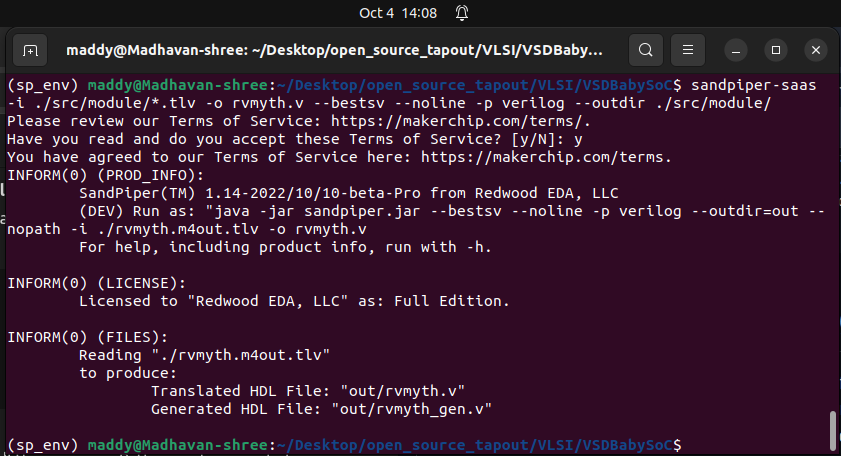</p>
---

<details>

<summary><h2> 1️⃣ Pre-Synthesis Simulation</h2></summary>

### 🛠️ RTL Compilation with Icarus Verilog

- 🔸 **Macro Used:** `DPRE_SYNTH_SIM`
- 🔸**Why:** To check the RTL design behavior before moving to synthesis.
- 🔸**Result:** An executable simulation file (`pre_synth_sim.out`) along with a `.vcd` waveform file inside `output/pre_synth_sim/`.

❗Before going to the simulation part, ensure that your project diectory like this

```
VSDBabySoC
├── images
├── LICENSE
├── Makefile
├── output
│   ├── pre_synth_sim
├── README.md
├── sp_env
├── src

```
- If not like this create the folder accordingly.

👉 Use the following command to launch the pre-synthesis simulation:

```bash
iverilog -o output/pre_synth_sim/pre_synth_sim.out   -DPRE_SYNTH_SIM   -I src/include   -I src/module   src/module/testbench.v

cd output/pre_synth_sim

ls

```

<p align="center">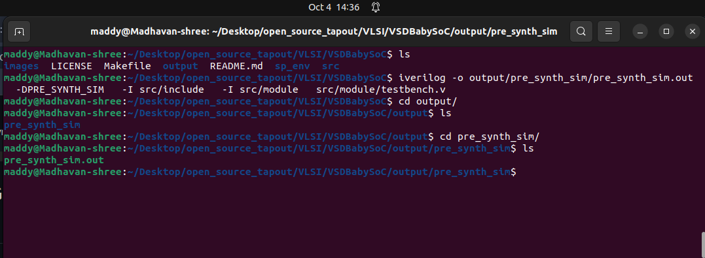</p>
<br><br>

👉 Then to produce ```.vcd``` file and to see the waveform in ```Gtkwave``` flow the commands
```
./pre_synth_sim.out

gtkwave pre_synth_sim.vcd

```

<p align="center">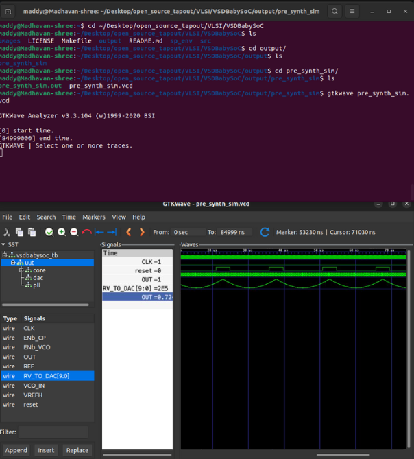</p>
---

## **Measured observations**

### **1) Reset — behavior & effect** 

**Measured:** **reset asserted at 20 ns and deasserted at 120 ns (80 ns pulse).**

**Observed:** while reset is high, instruction fetch is disabled and register file entries are set to known index values (SandPiper reset behavior). After reset deassertion, fetch resumes and **PC** increments by 4.

**report:**

> “Reset asserted from 20 ns to 120 ns. Fetch disabled and register file initialized during reset; normal execution resumes after release.” 🔍
> 

---

### **2) Clock — generation & period** 

**Expected (RTL):** `avsdpll.v` initial period = **25 ns → 40 MHz**.

**Measured:** using two GTKWave cursors on consecutive rising edges → **≈ 25 ns (40 MHz)**.

**Implication:** core registers and pipeline stages are clocked as intended.

**report:**

> “Measured clock period ≈ 25 ns → 40 MHz (two cursors on successive CLK rising edges).”
> 

---

### **3) Data path: CPU → DAC → OUT (numeric check)** 

**DAC transfer (from `avsddac.v`):**

```verilog
OUT = VREFL + (Dext / 1023.0) * (VREFH - VREFL)
where Dext = {1'b0, D}

```

**Observed sample:** **RV_TO_DAC = 225 → OUT ≈ 0.72 V** in waveform.

**Calculated:** **(225 / 1023) * 3.3 ≈ 0.726 V** (testbench uses `VREFH = 3.3`, `VREFL = 0.0`).

**Conclusion:** observed analog **OUT** matches predicted value — the CPU → DAC mapping is correct.

**report:**

> “RV_TO_DAC = 225 → OUT ≈ 0.72 V; matches expected OUT ≈ 0.726 V per DAC formula.”
> 

---

## **GTKWave: steps to analyze waveform**

1. `gtkwave pre_synth_sim.vcd`
2. Add signals: `uut` → `core` → **`RV_TO_DAC[9:0]`**, **`OUT`**, **`CLK`**, **`reset`**, and desired **`CPU_*`** internals.
3. Set bus radix to decimal: right-click **`RV_TO_DAC`** → **Radix** → **Unsigned (decimal)**.
4. Measure clock: zoom on **`CLK`**, place cursor A on a rising edge and cursor B on the next rising edge; read **ΔT** (status bar).
5. Measure reset window: place cursor on reset rising and cursor on reset falling; read **ΔT**.
6. Verify DAC mapping: hover **`RV_TO_DAC`** (decimal) and **`OUT`** at the same time and compare with **(code/1023)*VREFH**.

---

**The pre-synthesis run confirms correct reset behavior, a stable 40 MHz PLL clock, and accurate CPU→DAC mapping (digital codes produce expected analog voltages).** 


</details>
---


👉 Main Repo Link :  
[https://github.com/madhavanshree2006/RISC-V-SoC-Tapeout-Program](https://github.com/madhavanshree2006/RISC-V-SoC-Tapeout-Program)
